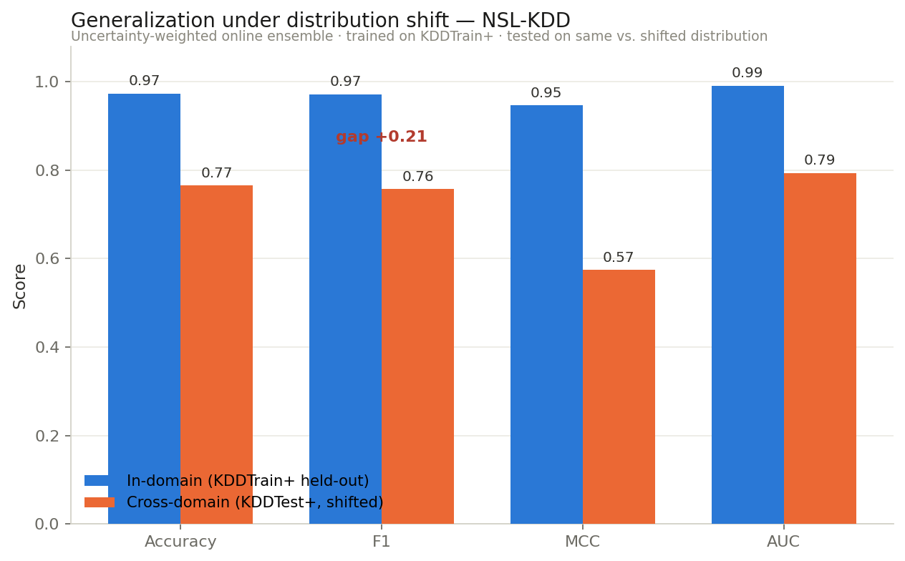

# Cross-Domain Generalization of Online Anomaly Detection on Network-Intrusion Data

**A PyTorch reimplementation of an uncertainty-weighted online-learning ensemble for anomaly detection, evaluated the way it actually matters: under distribution shift — trained on one attack distribution, tested on another.**

The method is a port of the drift-aware, minimum-uncertainty fusion from my
*Expert Systems with Applications* (2020) paper (originally MATLAB): an ensemble
of online linear learners whose predictions are combined with weights **inversely
proportional to each learner's prediction-error variance**. A learner making
stable, low-variance errors is trusted; an erratic one is automatically
down-weighted — which makes the ensemble drift-aware without an explicit drift
detector.

The point of this repo is not the in-domain score. It is the **generalization
gap**: how much a detector that looks excellent on its own data degrades when the
data shifts. This is the same question a clinical-AI model faces moving between
patient populations — here posed on network security data, where I can measure it
on a real, canonical benchmark.

> **Status:** ✅ runnable end-to-end on real data (NSL-KDD). Framework is
> dataset-agnostic; UNSW-NB15 / CICIDS2017 loaders are the next drop-in.

---

## Headline result — NSL-KDD

NSL-KDD ships two official splits, `KDDTrain+` and `KDDTest+`, that form a
built-in distribution shift: the test set deliberately contains attack types
under-represented or absent in training. Training on Train+ and testing on Test+
is therefore genuine **external validation**, not a random split.



| | Accuracy | F1 | MCC | AUC |
|---|:--:|:--:|:--:|:--:|
| **In-domain** (held-out KDDTrain+) | 0.97 | 0.97 | 0.95 | 0.99 |
| **Cross-domain** (KDDTest+, shifted) | 0.77 | 0.76 | 0.57 | 0.79 |
| **Generalization gap** | −0.21 | **−0.21** | −0.37 | −0.19 |

**Reading it:** a detector that scores F1 0.97 on data from its own distribution
falls to 0.76 the moment the attack mix shifts — a 21-point drop. An in-domain
number alone would badly overstate real-world performance. This is precisely why
external validation across distributions is the honest way to report a detector,
and the same failure mode a pathology model shows across hospitals/populations.

The uncertainty-weighted ensemble also edges out every individual base learner on
the shifted set (`results/nsl_kdd_generalization.json` has the full table).

---

## Method

```
  stream of labeled flows
          │
   ┌──────┼───────┬───────────┬──────────────────┐
   ▼      ▼       ▼           ▼                   │
 Percep  PA-I    PA-II   Confidence-Weighted      │  each learner updates online
   │      │       │           │                   │  and tracks its running
   └──────┴───┬───┴───────────┘                   │  error-variance
              ▼                                    │
   inverse-variance fusion  ← weight_k ∝ 1/Var(error_k)   (the contribution)
              ▼
        prediction (attack / normal)
```

- **Base learners** (`src/models/online_learners.py`): Perceptron, Passive-
  Aggressive (PA-I, PA-II), and a light Confidence-Weighted (AROW-style) learner
  — the LIBOL families the original paper benchmarked, reimplemented in PyTorch.
- **Fusion** (`src/models/uncertainty_ensemble.py`): the minimum-uncertainty
  combiner — the PyTorch port of the paper's `Dr_Sadoghi.m` contribution.
- **Metrics** (`src/eval/metrics.py`): accuracy, F1, MCC, RMSE (as in the paper)
  plus balanced accuracy, AUC, and the in-domain→cross-domain generalization gap.

---

## Quick start

```bash
pip install -r requirements.txt

# Run the generalization experiment on real NSL-KDD (auto-downloads ~22 MB):
PYTHONPATH=. python experiments/run_cross_dataset.py            # full stream
PYTHONPATH=. python experiments/run_cross_dataset.py --limit 20000   # fast

# Offline smoke tests (synthetic two-domain data, no download):
PYTHONPATH=. python tests/test_smoke.py
```

Results are written to `results/nsl_kdd_generalization.json`; the figure is
regenerated from it.

---

## Layout

```
src/
  models/online_learners.py       # Perceptron, PA-I/II, Confidence-Weighted (PyTorch)
  models/uncertainty_ensemble.py  # inverse-variance fusion (the contribution)
  data/nsl_kdd.py                 # real NSL-KDD loader (auto-download, leak-free)
  data/synthetic.py               # offline two-domain generator (no network)
  eval/metrics.py                 # metrics + generalization gap
experiments/run_cross_dataset.py  # train on Train+, test in-domain vs shifted Test+
tests/test_smoke.py               # runnable checks
docs/generalization.png           # the headline figure
```

---

## Roadmap

- [x] PyTorch port of the online ensemble + uncertainty fusion
- [x] Leak-free NSL-KDD loader (fit encoder/scaler on train only)
- [x] External-validation experiment + generalization-gap reporting + figure
- [ ] UNSW-NB15 and CICIDS2017 loaders → true cross-*dataset* validation (different sources), with a shared feature schema
- [ ] Concept-drift stream ordering (temporal, not shuffled) to exercise the drift-awareness directly
- [ ] Domain-adaptation baselines (CORAL, DANN) as comparison points

---

## Relation to the original work

This reimplements and re-frames the method from:

> E. Mahmodi, H. Sadoghi Yazdi, A. Ghaemi Bafghi. *A drift-aware adaptive method
> based on minimum uncertainty for anomaly detection in social networking.*
> Expert Systems with Applications, 2020. [doi:10.1016/j.eswa.2020.113881](https://doi.org/10.1016/j.eswa.2020.113881)

The original MATLAB code: [Emad-Mahmodi/AdaptiveLarning](https://github.com/Emad-Mahmodi/AdaptiveLarning).

## License
MIT — see `LICENSE`. NSL-KDD is downloaded from a public mirror at run time and is
not redistributed here.

## Author
**Emad Mahmodi** · [portfolio](https://emad-mahmodi.github.io)
